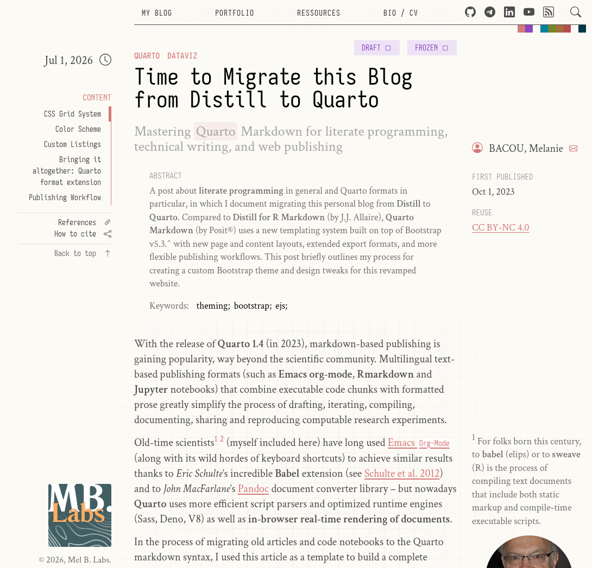
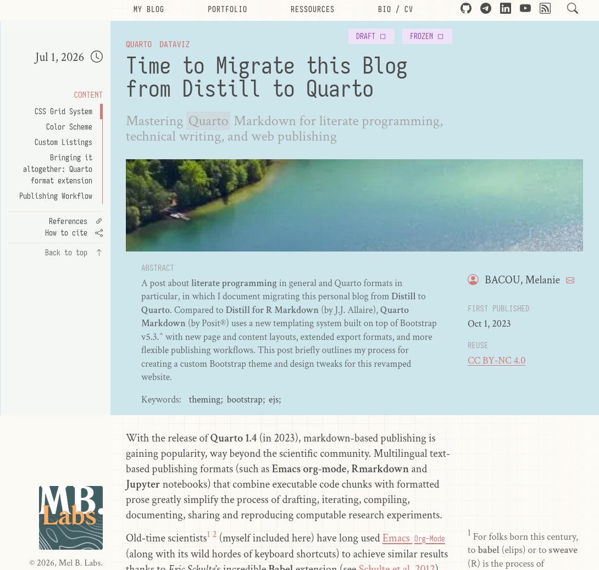

# mb-article Quarto Format

Responsive 3-column format for Quarto HTML documents and website projects. The format provides an optional document header and places **all project branding and table-of-content on the left sidebar**. 

Colors and typography are controlled via `_brand.yml`. The default Bootstrap theme was modified slightly to improve vertical rythm. The 3-column page design is fully responsive.



Standard Quarto document banner color and/or image remain available.



## Installing

```bash
quarto use template mbacou/mb-article
```

This will install the extension and create an example `.qmd` file that you can use as a starting place for your article.

## Using

This template provides additional format configuration options, as shown below (to be included in the document front matter or in a project-level `_quarto.yml` file per standard practices). This will display a minimum document header, as well as branding elements in the left column (sidebar).

```yaml
format:
  mb-article-html:
      logo: logo.svg
      logo-href: ./
      license: CC BY-NC 4.0
      copyright: © 2026, Mel B. Labs.
      header:
        palette: true      // show Bootstrap semantic colors
        left:
          - text: Link 1
            icon: link
            href: ./
          - text: Link 2
            icon: link
            href: ./
          - text: Link 3
            icon: link
            href: ./         
        right: 
          - icon: github
            href: https://github.com/mbacou/mb-article
          - icon: telegram
            href: https://t.me/mbacou
          - icon: linkedin
            href: https://linkedin.com/in/mbacou
          - icon: youtube
            href: https://youtube.com/\@mbacou/playlists
```

## Example

Here is the source code for a minimal sample document [index.qmd](index.qmd).
