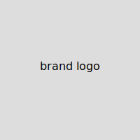

# Introduction

This document is an example that demonstrates the formatting and features of the current HTML format extension for Quarto.

Here is a sample margin note. The left column can also include side margins, but note that they will display above the TOC and branding (see below).

::: {.aside .text-serif .fs-1 .mb-2}
aside -- A note placed in the page margin with CSS classes `.aside .text-serif`.
:::

Lorem Ipsum is simply dummy text of the printing and typesetting industry. Lorem Ipsum has been the industry's standard dummy text ever since the 1500s, when an unknown printer took a galley of type and scrambled it to make a type specimen book.

::: {.aside .bg-danger-subtle .text-danger .p-2}
aside -- A note placed in the page margin with CSS class `.aside .bg-danger-subtle .text-danger`.
:::

Lorem Ipsum is simply dummy text of the printing and typesetting industry. Lorem Ipsum has been the industry's standard dummy text ever since the 1500s, when an unknown printer took a galley of type and scrambled it to make a type specimen book.

**More Information**

You can learn more about controlling the appearance of HTML output at <https://quarto.org/docs/output-formats/html-basics.html>.

# Brand Colors

Bootstrap colors inherit from [_brand.yml](_brand.yml) so customizations are straightforward.

<div class="d-flex gap-1 text-sans mb-2">
<div class="flex-fill p-1 text-bg-info">Info</div>
<div class="flex-fill p-1 text-bg-success">Success</div>
<div class="flex-fill p-1 text-bg-warning">Warning</div>
<div class="flex-fill p-1 text-bg-danger">Danger</div>
</div>
<div class="d-flex gap-1 text-sans">
<div class="flex-fill p-1 text-bg-primary">Primary</div>
<div class="flex-fill p-1 text-bg-secondary">Secondary</div>
<div class="flex-fill p-1 text-bg-light">Light</div>
<div class="flex-fill p-1 text-bg-dark">Dark</div>
</div>

# Typography

::: {.column-sidebar .bg-info-subtle .p-2 .text-info}
column-sidebar -- A note placed in the left column with CSS class `column-sidebar`.
:::

Bootstrap default line-height and font sizing typically work, but this format enforces a strict vertical rhythm whenever possible[^1]. I made sure to define all vertical spacing and padding as multiples of a standard line height of `$spacer`.

[^1]: About **vertical rhythm** and why it matters for content readability, see [Klaas Leussink](https://hnldesign.hashnode.dev/setting-a-flexible-baseline-grid-in-css) article on his personal blog.

No additional changes to font definitions aside from using `Crimson Pro` and `M+ Code` fonts[^2] by default, but always customizable via `_brand.yml` utility.

[^2]: M+ font system was designed by Japanese artist [Coji Morishita](https://mplusfonts.github.io/) with extended support for Latin, Japanese, Cyrillic. It is an excellent monospace font for smaller display sizes.

::: {.aside}
{.rounded-circle}

A rounded image with `.rounded-circle` moved to the margin.
:::

Here are **bold**, *italic*, and <small>smaller</small> text spans. Here are ^superscript^ and ~subscript~ characters, and ~~strikethrough~~ notes. Standard Bootstrap semantic colors with e.g. [.text-info]{.text-info} provide accented text. In addition this theme uses [.text-muted]{.text-muted} to de-emphasize content such as post metadata, margin notes, and captioning.

## Heading 2

> Quoted lines.
> <small>With a signature</small>

### Heading 3

Sample paragraph content with list of items:

-   List 1
    -   List 1.1
    -   List 1.2
-   List 2
-   List 3

Ordered list:

1.  List 1
2.  List 2
3.  List 3

Finally a normal rule `hr` divider.

------------------------------------------------------------------------

And a paragraph of content after the rule.

#### Heading 4

By default citations (and cross-references) are read in from an external `references.bib` file, but this may be edited in the YAML front matter as usual. Each citation must have a key, composed of ‘\@’ + the citation identifier from the database. Here is a margin reference to [@xie2015].

##### Heading 5

Here is a long footnote reference[^3]. Caption and footnote placement can be controlled in the config files `_quarto_yml` and/or `_metadata.yml`, or directly in the YAML front matter.

[^3]: Here's a margin note with multiple paragraph blocks and a fancy section header.

    ##### Heading 5

    With subsequent paragraphs indented to show that they belong to the previous footnote.

###### Section 6

Headers at level 6 are used as fancy section dividers.


# Figures & Plots

```{r}
#| column: page-right
#| fig-cap: A sample dynamic graph

library(ggplot2)

ggplot(mtcars, aes(factor(carb), mpg, fill = factor(carb))) +
  geom_col() +
  guides(fill = guide_legend(nrow = 1)) +
  labs(
    title = "Custom ggplot with Bootstrap brand",
    subtitle = "Theme provided by R package `mblabs`",
    caption = "A long plot caption with many references
    over multiples lines."
  ) +
  theme(legend.position = "bottom")
```


# Tables

I prefer my tables to resemble LaTeX typesetting, so a few simple changes here.

|        |      |
|--------|-----:|
| apple  | 2.05 |
| pear   | 1.37 |
| orange | 3.09 |

: Caption: my default table spacing

| fruit  | price |
|--------|-------|
| apple  | 2.05  |
| pear   | 1.37  |
| orange | 3.09  |

: Caption: compact spacing borderless {.borderless .hover .sm}

| fruit  | price |
|--------|-------|
| apple  | 2.05  |
| pear   | 1.37  |
| orange | 3.09  |

: Caption: striped hover {.striped .hover}

::: column-page-right
A table running over the right margin.

| fruit  | price |
|--------|-------|
| apple  | 2.05  |
| pear   | 1.37  |
| orange | 3.09  |

: Caption: striped hover secondary {.striped .hover .secondary}
:::

::: column-page-left
A table running over the left sidebar.

| fruit  | price |
|--------|-------|
| apple  | 2.05  |
| pear   | 1.37  |
| orange | 3.09  |

: Caption: striped primary {.striped .primary}
:::

```{r}
#| column: page
#| tbl-cap: A full-width table to increase content space

knitr::kable(mtcars[1:6, 1:10])
```


